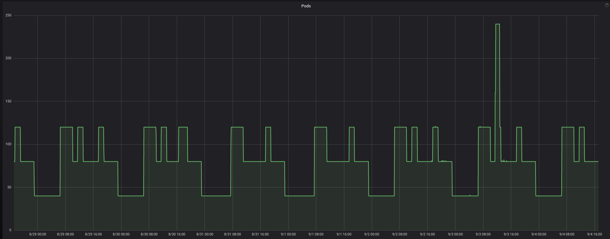

# Kubernetes Schedule Scaler

This Application/ Kubernetes controller is used to schedule scale deployments and other custom resources in the cluster like Stackset based in annotations.
The controller can work in conjunction with hpa. if hpa is configured the controller can adjust minReplicas and maxReplicas.
At the moment it supports reading the scaling definitions from:
  - directly in the annotations
  - JSON files in S3 bucket
    - The S3 bucket should be exist and the controller/pod should have read access to the bucket. by
      Using this way you do not have to redeploy your application if you need to change the scaling definitions


## Usage


Just add the annotation to either your `Deployment` or `Stackset`.

```
  annotations:
    zalando.org/schedule-actions: '[{"schedule": "10 18 * * *", "replicas": "3"}]'
```

or

you can add your scaling definitions in json file and upload the file to S3 bucket.

```
  annotations:
    zalando.org/schedule-actions: s3://schedule-scaling/catalog.json
```
Note:
  - The controller should have access to the bucket s3://schedule-scaling/
  - Example of the JSON files are in the folder s3-json-files/
## Available Fields 

The following fields are available
* `schedule` - Typical crontab format
* `replicas` - the number of replicas to scale to
* `minReplicas` - in combination with an `hpa` will adjust the `minReplicas` else be ignored
* `maxReplicas` - in combination with an `hpa` will adjust the `maxReplicas` else be ignored

### Deployment Example

```bash
kind: Deployment
metadata:
  name: nginx-deployment
  labels:
    application: nginx-deployment
  annotations:
    zalando.org/schedule-actions: |
      [
        {"schedule": "30 4 * * 1,2,3,4,5", "minReplicas": "{{{HIGH_LOAD_REPLICAS}}}"},
        {"schedule": "00 8 * * 1,2,3,4,5", "minReplicas": "{{{REPLICAS}}}"},
        {"schedule": "00 21 * * 1,2,3,4,5", "minReplicas": "{{{MIN_REPLICAS}}}"},
        {"schedule": "30 5 * * 6,7", "minReplicas": "{{{HIGH_LOAD_REPLICAS}}}"},
        {"schedule": "00 9 * * 6,7", "minReplicas": "{{{REPLICAS}}}"},
        {"schedule": "00 21 * * 6,7", "minReplicas": "{{{MIN_REPLICAS}}}"}
      ]
```


### StackSet Example

```bash
apiVersion: zalando.org/v1
kind: StackSet
metadata:
  name: {{{APPLICATION_NAME}}}
  labels:
    application: "{{{APPLICATION}}}"
    stage: "{{{STAGE}}}"
  annotations:
    zalando.org/schedule-actions: '[{"schedule": "00 06 * * *", "replicas": "20"}, {"schedule": "30 14 * * *", "replicas": "{{{REPLICAS}}}", "minReplicas": "{{{REPLICAS}}}"}]'
```

## Debugging

If your scaling action has not been executed for some reason, you can check with the below steps:

```bash
kubectl get pod | grep kube-schedule
kube-schedule-scaler-75644b8f79-h59s2                    1/1       Running                 0          3d
```
Check the logs for your specific deployment/stack
```bash
kubectl logs kube-schedule-scaler-75644b8f79-h59s2 | grep scale | grep node-live
Stack pegasus-node-live has been scaled successfully to 40 minReplicas at 11-03-2019 21:00 UTC
Stack pegasus-node-live has been scaled successfully to 120 minReplicas at 12-03-2019 05:30 UTC
Stack pegasus-node-live has been scaled successfully to 80 minReplicas at 12-03-2019 07:00 UTC
Stack pegasus-node-live has been scaled successfully to 40 minReplicas at 12-03-2019 21:00 UTC
Stack pegasus-node-live has been scaled successfully to 120 minReplicas at 13-03-2019 05:30 UTC
Stack pegasus-node-live has been scaled successfully to 80 minReplicas at 13-03-2019 07:00 UTC
Stack pegasus-node-live has been scaled successfully to 40 minReplicas at 13-03-2019 21:00 UTC
Stack pegasus-node-live has been scaled successfully to 120 minReplicas at 14-03-2019 05:30 UTC
Stack pegasus-node-live has been scaled successfully to 80 minReplicas at 14-03-2019 07:00 UTC
Stack pegasus-node-live has been scaled successfully to 40 minReplicas at 14-03-2019 21:00 UTC
Stack pegasus-node-live has been scaled successfully to 120 minReplicas at 15-03-2019 05:30 UTC
Stack pegasus-node-live has been scaled successfully to 80 minReplicas at 15-03-2019 07:00 UTC

```

<p align="center">

</p>


Check for specific deployment at specific time
```bash
kubectl logs kube-schedule-scaler-87f9649f5-btnt7 | grep nginx-deployment-2 | grep "28-12-2018 09:50"
Deployment nginx-deployment-2 has been scaled successfully to 4 replica at 28-12-2018 09:50 UTC
```

You can also check from scalyr side
```bash
$application == "kube-schedule-scaler" 'nginx-deployment-2'
```
